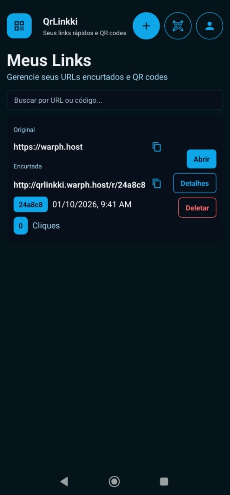
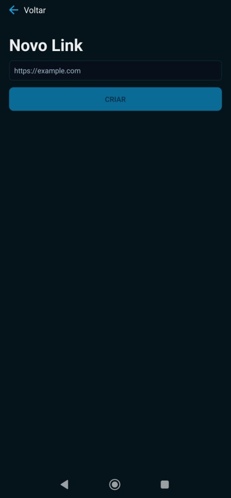

# QrLinkki

<div align="center">
  
</div>

### Plataforma Moderna de Geração de QR Codes e Encurtador de URLs

[](https://dotnet.microsoft.com/)
[](https://www.android.com/)
[](https://reactnative.dev/)
[](https://expo.dev/)
[](https://www.typescriptlang.org/)
[](LICENSE)

[](https://github.com/OS-2-Warper/QrLinkki/actions/workflows/deploy-backend.yml)

[](https://github.com/OS-2-Warper/QrLinkki/releases/tag/v1.0)

**QrLinkki** é uma plataforma full-stack para criar, gerenciar e rastrear QR codes e URLs encurtadas, com foco em uma experiência nativa para **Android**. Construída com princípios de **Domain-Driven Design**.

[Funcionalidades](#-funcionalidades) • [Como Rodar](#-como-rodar-o-projeto) • [Stack Tecnológica](#-stack-tecnológica)

> **Versão de Teste (v1.0):** uma versao de teste está disponível — baixe a build em releases https://github.com/OS-2-Warper/QrLinkki/releases/tag/v1.0

</div>

---

## ✨ Funcionalidades

### 🎯 Funcionalidades Principais
- **Geração de QR Codes** — Crie QR codes dinâmicos a partir de qualquer URL ou texto
- **Encurtamento de URLs** — Gere links curtos e memoráveis com códigos personalizados
- **Contagem de Cliques** — Visualize quantos acessos seus links tiveram
- **Gerenciamento de Usuários** — Autenticação segura com tokens JWT
- **Redirecionamentos Públicos** — Redirecionamento transparente a partir de URLs curtas

### 📱 Aplicativo
- **Android Nativo** — Desenvolvido e otimizado especificamente para o ecossistema Android
- **Scanner de QR** — Scanner de câmera integrado para QR codes
- **Dashboard** — Gerencie todos os seus links em um só lugar
- **Design Moderno** — Interface visualmente agradável
- **Suporte Offline** — Cache local para melhor performance

> [!NOTE]
> **Compatibilidade:** Este projeto foi desenvolvido e testado exclusivamente em dispositivos **Android**. Embora utilize React Native, o funcionamento em iOS ou Web não foi verificado e pode exigir adaptações.

### 🔒 Segurança
- **Autenticação JWT** — Autenticação segura baseada em tokens
- **Acesso Exclusivo do Proprietário** — Apenas donos dos links podem modificar seu conteúdo
- **Proteção de Dados** — Armazenamento seguro de credenciais

---

## 🖼️ Showcase

Algumas telas e exemplos do projeto:

<p align="center">
  
  
  
</p>

---

## 🏗️ Arquitetura

QrLinkki segue os princípios de **Clean Architecture** e **Domain-Driven Design**:

```
┌─────────────────────────────────────────────────────────┐
│                    QrLinkki.Api                         │
│            (Camada de Apresentação / REST API)          │
│          Controllers • Swagger • Autenticação           │
└────────────────────┬────────────────────────────────────┘
                     │
┌────────────────────▼────────────────────────────────────┐
│               QrLinkki.Application                      │
│          (Camada de Aplicação / Casos de Uso)           │
│        Services • DTOs • Orquestração de Negócios       │
└────────────────────┬────────────────────────────────────┘
                     │
┌────────────────────▼────────────────────────────────────┐
│                QrLinkki.Domain                          │
│           (Camada de Domínio / Lógica Central)          │
│         Entidades • Interfaces • Regras de Negócio      │
└────────────────────┬────────────────────────────────────┘
                     │
┌────────────────────▼────────────────────────────────────┐
│             QrLinkki.Infrastructure                     │
│         (Camada de Infraestrutura / Acesso a Dados)     │
│    EF Core • SQLite • Repositories • Migrations         │
└─────────────────────────────────────────────────────────┘
```

### Arquitetura Frontend

```
QrLinkki.Web/
├── app/                    # Páginas do Expo Router
│   ├── (auth)/            # Telas de autenticação
│   ├── (tabs)/            # Telas de navegação em abas
│   └── links/             # Telas de gerenciamento de links
├── components/            # Componentes UI reutilizáveis
├── lib/                   # Cliente API e utilitários
├── hooks/                 # Hooks personalizados do React
└── constants/             # Tokens de tema e configurações
```

---

## 🚀 Stack Tecnológica

### Backend

| Tecnologia | Versão | Finalidade |
|-----------|---------|---------|
| **.NET** | 8.0 | Framework principal |
| **ASP.NET Core** | 8.0 | Framework de API Web |
| **Entity Framework Core** | 9.0 | ORM e acesso a banco de dados |
| **SQLite** | - | Banco de dados embutido |
| **JWT Bearer** | 8.0 | Autenticação |
| **Swagger/OpenAPI** | 9.0 | Documentação da API |

### Frontend

| Tecnologia | Versão | Finalidade |
|-----------|---------|---------|
| **Expo** | ~54.0 | Framework mobile |
| **React Native** | 0.81 | Framework de UI |
| **React** | 19.1 | Biblioteca de UI |

## 📱 Como Rodar o Projeto

Este projeto utiliza scripts PowerShell para facilitar o build e desenvolvimento Android.

### Pré-requisitos
- Node.js
- JDK 17 ou 21
- Android Studio (para emulador/SDK)

### Instalação

```bash
cd QrLinkki.Web
npm install
```

### Desenvolvimento (Hot Reload)

Para iniciar o servidor de desenvolvimento:

```bash
npm run dev:android
```

Se for a primeira vez rodando, ou se adicionou novas bibliotecas nativas, gere o cliente de desenvolvimento:

```bash
npm run build:android:dev
```

### Staging (Pré-Produção)

Para gerar um APK de staging (instalável ao lado da versão de produção):

```bash
npm run build:android:staging
```

### Produção

Para gerar o APK final:

```bash
npm run build:android:release
```

---

## 📡 Endpoints da API

### Autenticação e Usuários

```http
POST   /api/users              # Registrar novo usuário
GET    /api/users              # Listar todos os usuários (autenticado)
GET    /api/users/{id}         # Obter usuário por ID
PUT    /api/users/{id}         # Atualizar usuário
DELETE /api/users/{id}         # Deletar usuário
```

### Links e QR Codes

```http
POST   /api/links              # Criar link curto com QR code
GET    /api/links              # Obter todos os links do usuário autenticado
GET    /api/links/{code}       # Obter detalhes do link
PUT    /api/links/{code}       # Atualizar link
DELETE /api/links/{code}       # Deletar link
GET    /r/{code}               # Redirecionamento público (rastreia cliques)
```

### 📚 Documentação Completa da API

Quando a API estiver rodando, visite `http://localhost:5000/swagger` para documentação interativa da API.

---

## 📱 Funcionalidades do Frontend

### Fluxo de Autenticação
- Login/registro seguro com JWT
- Atualização automática de token
- Persistência de sessão com armazenamento seguro
- Auto-logout em respostas 401

### Dashboard
- Visão geral visual dos links com estatísticas
- Ações rápidas: copiar, compartilhar, editar, deletar
- Rastreamento de cliques em tempo real
- Layout em grid responsivo

### Gerenciamento de Links
- Criar códigos curtos personalizados
- Gerar QR codes automaticamente
- Definir datas de expiração
- Habilitar/desabilitar links

### Scanner de QR
- Integração nativa com câmera
- Detecção de QR code em tempo real
- Redirecionamento automático ao escanear

---

## 🛠️ Desenvolvimento

### Estrutura do Projeto

```
QrLinkki/
├── QrLinkki.Api/              # Camada de API REST
├── QrLinkki.Application/      # Camada de lógica de negócios
├── QrLinkki.Domain/           # Entidades de domínio e interfaces
├── QrLinkki.Infrastructure/   # Acesso a dados e serviços externos
├── QrLinkki.Web/              # Aplicativo frontend Expo
├── data/                      # Banco de dados SQLite
├── api-storage/               # Uploads de arquivos e QR codes
└── docker-compose.*.yml       # Configurações do Docker
```

### Executando Testes

```bash
# Testes do backend
dotnet test

# Testes do frontend (se configurado)
cd QrLinkki.Web
npm test
```

### Build para Produção

```bash
# Backend
dotnet publish -c Release -o ./publish

# Frontend (Android - usa Gradle)
cd QrLinkki.Web
npm run build:android:release
```

---


## 🐛 Solução de Problemas

### Problemas Comuns

**Backend não inicia:**
- Certifique-se de que a porta 5000 não está em uso
- Verifique se o .NET 8.0 SDK está instalado
- Verifique as permissões do banco de dados na pasta `data/`

**Frontend não conecta à API:**
- Verifique se a API está rodando em `http://localhost:5000`
- Verifique a configuração de CORS no backend
- Em dispositivos móveis, certifique-se de que PC e celular estão na mesma rede

**Problemas de conexão com Expo Go:**
- Certifique-se de que os dispositivos estão na mesma rede WiFi
- Verifique as configurações do firewall
- Tente reiniciar o Metro bundler

---

## 🔐 Notas de Segurança

> **Importante:** O endpoint público de redirecionamento `/r/{code}` é intencionalmente público para permitir que QR codes sejam escaneados por qualquer pessoa. Se você precisa de links privados, será necessário implementar autenticação neste endpoint (nota: isso quebrará a funcionalidade pública dos QR codes).

- Todas as operações de gerenciamento de links requerem autenticação
- Usuários só podem modificar seus próprios links e perfil
- Tokens JWT são armazenados de forma segura usando Expo SecureStore
- Rastreamento de cliques registra endereços IP para análise
---
## 👨‍💻 Contribuidores

**QrLinkki** é desenvolvido e mantido por:

<table>
  <tr>
    <td align="center">
      <a href="https://github.com/alexscarano">
        
        <br />
        <b>Alex Scarano</b>
      </a>
      <br />
      <sub>Backend (API .NET + Arquitetura)</sub>
    </td>
    <td align="center">
      <a href="https://github.com/Wpnnt">
        
        <br />
        <b>Wpnnt</b>
      </a>
      <br />
      <sub>Frontend (React Native App)</sub>
    </td>
  </tr>
</table>


---

## 🌟 Suporte

Se você achar este projeto útil, considere dar uma ⭐️ no GitHub!

Para dúvidas ou suporte, por favor [abra uma issue](https://github.com/OS-2-Warper/QrLinkki/issues).

---

## 📄 Licença

Este projeto está licenciado sob a **Licença MIT** - veja o arquivo [LICENSE](LICENSE) para detalhes.

---

<div align="center">

**Feito com ❤️ usando .NET e React Native**

</div>
